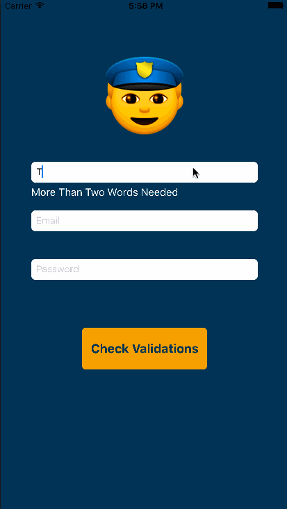

# SwiftCop

SwiftCop is a validation library fully written in Swift and inspired by the verbosity and clarity of [Ruby On Rails Active Record validations](http://guides.rubyonrails.org/active_record_validations.html).

[](https://travis-ci.org/andresinaka/SwiftCop)

[](https://codecov.io/github/andresinaka/SwiftCop?branch=master)

### Objective

Build a standard drop-in library for validations in Swift while making it easily extensible for users to create custom validations. And avoid developers from writting over and over again the same code and validations for different projects.

## Features

- Quickly validations.
- Super simple and verbose syntax.
- Easily extensible.
- Fully Swift 2.0

## Modules

SwiftCop was built around three different concepts:

### Trial

```Trial``` is an ```Enum``` that implements the ```TrialProtocol```

```swift
public protocol TrialProtocol {
	func trial() -> ((evidence: String) -> Bool)
}
```

We can use ```Trial``` to quickly validate ```strings```. ```SwiftCop``` ships with a very fully featured ```Trial``` implementation. The following trials are provided:

#### ```Exclusion([String])```
This validates that the attributes are not included in the evidence string.

```swift
let exclusionTrial = Trial.Exclusion([".com",".ar", ".uy"])
let trial = exclusionTrial.trial()
XCTAssertFalse(trial(evidence: "http://www.nytimes.com"))
```

#### ```Format(String)```
This validates whether the evidence matches a given regular expression.

```swift
let formatTrial = Trial.Format("^#([a-f0-9]{6}|[a-f0-9]{3})$") // hexa number with #
let trial = formatTrial.trial()		
XCTAssertTrue(trial(evidence: "#57b5b5"))
```

#### ```Inclusion([String])```
This validates that the attributes are included in the evidence string.

```swift
let inclusionTrial = Trial.Inclusion([".com",".ar", ".uy"])
let trial = inclusionTrial.trial()
XCTAssertTrue(trial(evidence: "http://www.nytimes.com"))
```

#### ```Email```
This validates whether the evidence is an email or not.

```swift
let emailTrial = Trial.Email
let trial = emailTrial.trial()
XCTAssertTrue(trial(evidence: "test@test.com"))
```

#### ```Length(Lenght,Any)```
This validates the lenght of given evidence:

```swift
let lengthTrial = Trial.Length(.Is, 10)
let trial = lengthTrial.trial()
XCTAssertTrue(trial(evidence: "0123456789"))
```
```swift
let lengthTrial = Trial.Length(.Minimum, 10)
let trial = lengthTrial.trial()
XCTAssertTrue(trial(evidence: "0123456789"))
```
```swift
let lengthTrial = Trial.Length(.Maximum, 10)
let trial = lengthTrial.trial()		
XCTAssertTrue(trial(evidence: "0123456789"))
```
```swift
let interval = Trial.Length(.In, 2..<5 as HalfOpenInterval)
let trial = interval.trial()
XCTAssertTrue(trial(evidence: "1234"))
```
```swift
let interval = Trial.Length(.In, 2...5 as ClosedInterval)
let trial = interval.trial()
XCTAssertFalse(trial(evidence: "123456"))
```

### Suspect

The ```Suspect``` is a ```Struct``` that is the glue between some other concepts always used while validating fields. It puts together a ```UITextField``` that is going to be the source of the ```evidence```, a ```sentence``` that is going to be the text shown if the ```suspect``` is guilty (when the ```Trial``` returns false) and the ```Trial``` itself, that can be a custom made trial for the suspect or you can use one of the trials provided by the library:

```swift
Suspect(view: UITextField, sentence: String, trial: TrialProtocol)
Suspect(view: UITextField, sentence: String, trial: (evidence: String) -> Bool)
```

We can check if the ```Suspect``` is guilty or not with:

```
func isGuilty() -> Bool
```

This method is going to return ```true``` if the ```Trial``` returns ```false```.

Also we can dirrectly ask for the ```verdict``` on the ```Suspect```, this is going to check if it's guilty or not and then return and empty string (```""```) or the ```sentence```.

For example: 

```swift
let suspect = Suspect(view: self.dummyTextField, sentence: "Invalid email", trial: .Email)		
let verdict = suspect.verdict() // this can be "" or "Invalid Email"
```

### SwiftCop

Finally we have the guy that is going to enforce the validations! The cop is going to get all the suspects together and give us the tools to check who are the guilty suspects or if there is any guilty suspect at all.

As you can imagine this is going to add a suspect under the vigilance of a cop, we can add as many suspects as we want:

```swift
public func addSuspect(suspect: Suspect)
```

This let us check if there is any guilty suspect between all the suspects under the surveillance of our cop:

```swift
public func anyGuilty() -> Bool
```

This will let us know all the guilty suspects our cop found:

```swift
public func allGuilties() -> Array<Suspect>
```

This let us check if a UITextField that is suspect is guilty or not:

```swift
public func isGuilty(textField: UITextField) -> Suspect?
```

## Example

The example is shipped in the repository:

```Swift

class ViewController: UIViewController {
	@IBOutlet weak var validationLabel: UILabel!
	
	@IBOutlet weak var fullNameMessage: UILabel!
	@IBOutlet weak var emailMessage: UILabel!
	@IBOutlet weak var passwordMessage: UILabel!

	@IBOutlet weak var fullName: UITextField!
	@IBOutlet weak var emailTextField: UITextField!
	@IBOutlet weak var password: UITextField!
	
	// Let's create a cop!
	let swiftCop = SwiftCop()
	
	override func viewDidLoad() {
		super.viewDidLoad()
		
		//Let's add all the suspects
		swiftCop.addSuspect(Suspect(view: self.fullName, sentence: "More Than Two Words Needed"){
			return $0.componentsSeparatedByString(" ").filter{$0 != ""}.count >= 2
		})
		swiftCop.addSuspect(Suspect(view:self.emailTextField, sentence: "Invalid email", trial: Trial.Email))
		swiftCop.addSuspect(Suspect(view:self.password, sentence: "Minimum 4 Characters", trial: Trial.Length(.Minimum, 4)))
	}

	@IBAction func validateFullName(sender: UITextField) {
		self.fullNameMessage.text = swiftCop.isGuilty(sender)?.verdict()
	}

	@IBAction func validateEmail(sender: UITextField) {
		self.emailMessage.text = swiftCop.isGuilty(sender)?.verdict()
	}
	
	@IBAction func validatePassword(sender: UITextField) {
		self.passwordMessage.text = swiftCop.isGuilty(sender)?.verdict()
	}

	@IBAction func allValid(sender: UITextField) {
		let nonGultiesMessage = "Everything fine!"
		let allGuiltiesMessage = swiftCop.allGuilties().map{ return $0.sentence}.joinWithSeparator("\n")
		
		self.validationLabel.text = allGuiltiesMessage.characters.count > 0 ? allGuiltiesMessage : nonGultiesMessage
	}
	
	@IBAction func hideKeyboard(sender: AnyObject) {
		self.view.endEditing(true)
	}
}
```



# Installation

### Setting up with [CocoaPods](http://cocoapods.org/)

- TODO

### Setting up with [Carthage](https://github.com/Carthage/Carthage)

- TODO